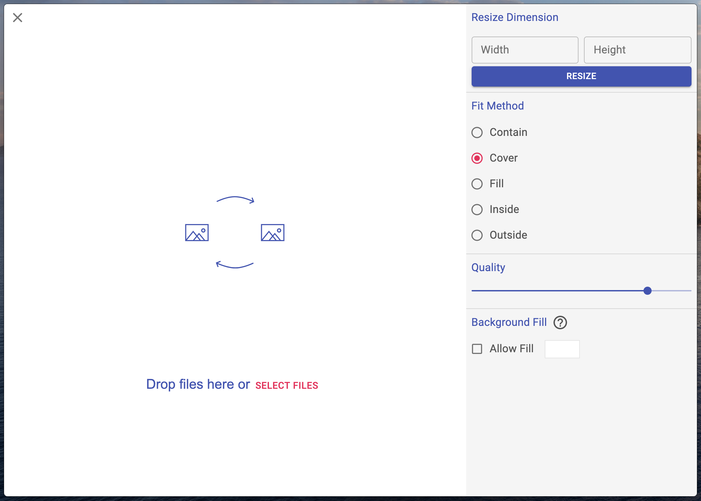

<div align="center">
    
</div>

## Boyut Resizer

<p>
Boyut Resizer is an image resizer application which based on React, React Router, Webpack, React Hot Loader.
</p>

[](https://github.com/mustafademirtas/boyut-resizer/issues)
[](https://github.com/mustafademirtas/boyut-resizer/tags)
[](https://github.com/mustafademirtas/boyut-resizer/blob/master/LICENSE)

#### Screenshot

<div align="center">
    
</div>

## Install
```bash
git clone https://github.com/mustafademirtas/boyut-resizer
cd boyut-resizer
yarn
```

## Starting Development

Start the app in the `dev` environment. This starts the renderer process in [**hot-module-replacement**](https://webpack.js.org/guides/hmr-react/) mode and starts a webpack dev server that sends hot updates to the renderer process:

```bash
yarn dev
```

## Packaging for Production

To package apps for the local platform:

```bash
yarn package
```

## Contribution
Feel free to contribute. Open a new [issue](https://github.com/mustafademirtas/boyut-resizer/issues), or make a [pull request](https://github.com/mustafademirtas/boyut-resizer/pulls).

## License
MIT © Boyut Resizer
